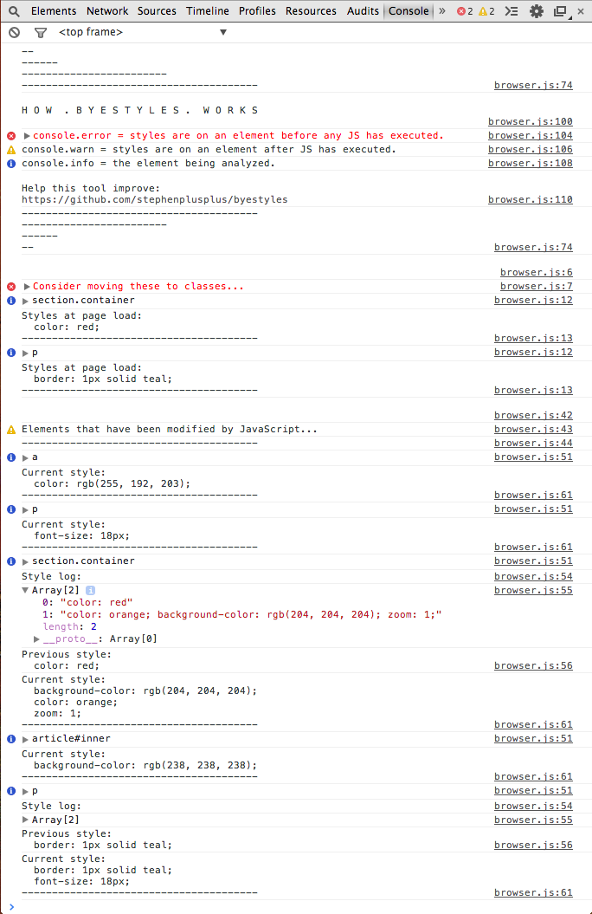

# byestyle.
> keep an eye on those pesky inline styles.


## [Demo](http://stephenplusplus.github.io/byestyle)



## Install
`byestyle` can be downloaded through [Bower](http://bower.io), [npm](http://npmjs.org) or [component](http://component.io).

#### Browser
```bash
$ bower install --save byestyle
```
```html
<script src="bower_components/byestyle/browser.js"></script>
```

#### Node.js
```bash
$ npm install --save byestyle
```

#### Component
```bash
$ component install stephenplusplus/byestyle
```
